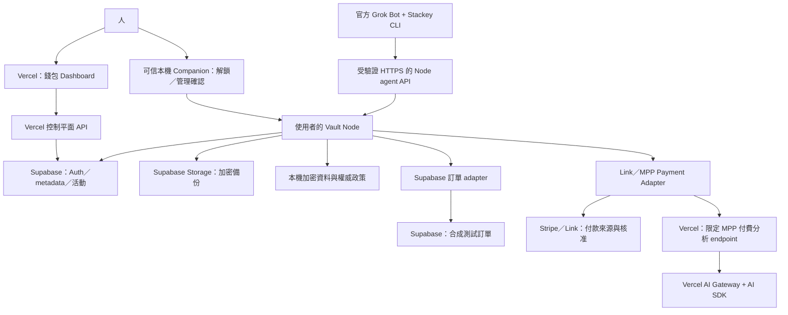

# Stackey 產品與技術規格 v0.8

日期：2026-10-03。狀態：完整產品規格；本機 CLI 配對、Owner 核准、DPoP session、合成訂單操作與撤銷已有實作。本文作為現行產品契約；實際範圍與 wire format 見 [CLI_PAIRING.md](CLI_PAIRING.md) 與 [CLI_AUTHORIZATION.md](CLI_AUTHORIZATION.md)。本機操作為 `demo.orders.read`，資料來源 `local_synthetic`；Supabase adapter、雲端、加密、付款與完整 demo 仍待實作／驗證。

## 1. 定位與問題

**一句話：服務連接一次，透過資源錢包把使用權交給 agent。**

使用者已有 GitHub、Supabase、Stripe、Vercel 等帳號，但憑證與登入狀態分散在不同機器和平台。新增 agent 執行環境時，需要重新找到 key、登入、配置存取並追蹤誰仍有權限。40 個 agent 放大的是跨服務、跨環境的配置與管理負擔。

Stackey 將 Connection 與 Agent Principal 分開：Connection 保留使用者已有的服務連接；新增 agent 只建立身分與 Grant，不複製所有服務憑證。首次連接服務、首次安裝／配對環境仍必要，供應商撤銷或要求驗證時仍可能需要人重新登入。

產品採錢包的資源、地址、公私鑰與助記詞概念，不需要鏈上帳戶、交易、gas 或代幣。參考 DCP 的 vault／bridge／policy／consent 責任分離，Stackey 獨立開發，未採用其程式碼，也未證明安全性優於 DCP。[參考架構](https://github.com/1lystore/dcp/blob/b32a94e979240366b4fb89a0b7f9c8f441698426/ARCHITECTURE.md)

## 2. 使用者、場景與成功條件

| 場景 | 需求 | 排程 |
| --- | --- | --- |
| 個人多 agent | 多環境共用既有 Connection，各有獨立授權 | 第一版核心 |
| 個人雇用新 agent | 任務期間使用限定資源，到期／結束停止 | 第一版 demo |
| 公司內部 | 組織擁有資源、管理員核准、成員離職撤銷 | 後續；不得共用員工助記詞 |
| 雇用外部 agent | 不交出完整秘密，可查活動與撤銷 | 沿用任務 Grant；不先建 marketplace |

「Hire Agent」代表接入既有 agent 並授權它完成工作；長期與一次任務是相同流程的不同有效期。「一次性」允許任務內多次工具呼叫，不代表供應商已建立臨時帳號。

成功條件：新 agent 取得所需使用權並完成第一項任務；使用者不重新輸入已連接服務的憑證；模型不收到服務 token／私鑰；使用者能確認資源、操作、期限並停止後續存取。

Agent 採用效果以真實任務完成率、人工介入、配對耗時與工具錯誤衡量，沒有「所有 agent 一定會用」的保證。

## 3. 範圍與優先級

### P0：核心 demo

- 建立／解鎖保險箱、助記詞備份與加密資料備份。
- 建立具地址的 Wallet，新增專用 Supabase 測試 Connection。
- CLI 安裝、一次性邀請、執行環境公鑰配對、人核准任務 Grant。
- 能力探索、操作 schema、限定訂單唯讀、分頁、可續做結果。
- 錢包顯示新 agent、任務、授權、活動、到期與撤銷。
- 官方 Grok Bot 完成一項可對照正確答案的真實合成資料任務。
- Vercel 錢包 dashboard，Supabase 管理資料／活動同步與 RLS。

### P1：三家技術的完整延伸驗收

- Stripe Link 付款來源與 MPP sandbox 真實 challenge／proof／receipt 流程。
- Vercel 上的限定付費分析 endpoint，使用 AI Gateway + AI SDK。
- 共用 Wallet 的預算預留、付款對帳、交付續取與防重複付款。
- Codex 第二環境接入，驗證同一 Connection 可被不同 Principal 使用。

三家技術的完整整合需要 P0 + P1 證據；只完成核心 demo 時不得聲稱 Stripe／AI Gateway 已整合完成。

### 後續

GitHub／Google／Vercel 資源 adapters、MCP 包裝、公司 RBAC、AgentMail／AgentPhone、真正臨時帳號 provision／cleanup、受控鏈上簽署、多個 active Node 與互通協定。

第一版 agent API 不提供任意秘密匯出、任意 URL／SQL／header 代理、通用私鑰簽章、agent 自行再授權。密碼與服務私鑰可以作為保管項目；自動登入與使用須逐一實作固定 adapter，不承諾任意網站都能免登入。

## 4. 架構與技術分工



| 元件 | 責任 | 邊界 |
| --- | --- | --- |
| Vercel／Next.js | 錢包 dashboard、控制平面 API、MPP 商戶 endpoint | 不保存 Owner seed、agent 私鑰或使用者 vault 解密材料 |
| AI Gateway + AI SDK | 付費分析 endpoint 的模型路由、工具／結構化輸出 | 模型輸出沒有權限變更或付款決策權 |
| Supabase | Dashboard Auth、管理 metadata、活動同步、加密備份、合成訂單 | Auth session 不等於 vault 解鎖或 Owner 管理授權 |
| Vault Node | 秘密使用、Grant 驗證、操作執行、預算與 operation 持久化 | 單一有效政策執行者；鎖定／離線即拒絕 |
| 本機 Companion | 可信的 seed 建立／復原、解鎖、管理簽章與批准 | Cloud UI 的提案須在此確認才生效 |
| CLI | 身分 proof、session、能力探索、操作與狀態查詢 | 不將秘密印到模型／日誌；不自行升權 |
| Stripe Link／MPP | 付款來源、供應商核准、付費資源的支付證明 | Stackey 預算不能覆蓋 Link 的核准／資格要求 |

Vercel 官方提供 AI SDK 與相容 API 接法；第一版選 TypeScript AI SDK，Python 為後續客戶端。模型 ID、SDK 版本與支援能力在實作時核實並鎖定，不把不同 API 格式當作完全相容。[AI Gateway 文件](https://vercel.com/docs/ai-gateway/sdks-and-apis)

Vercel AI Gateway 用在 Stackey 的可選分析資源；主 demo 的 agent 仍是官方 Grok Bot，不要求其原生模型請求經 Stackey，也不以自行建立的 Grok API 程式替代它。

Node 初期是使用者掌控的本機程序，提供獨立的 agent 路由與本機管理路由。官方 Grok Bot 需要可達的受驗證 HTTPS Node endpoint，建立方式及憑證固定必須實測。第一版不把常駐 Node 放進 Vercel Function，也不先做自製 relay／多主同步。

雲端 dashboard 顯示 metadata 和提出管理變更；真正的核准／撤銷在可信本機 Companion 完成。主 demo 可切換至本機錢包確認畫面。雲端管理意圖經有限 action／參數傳給 Companion，需獨立配對、nonce、期限、完整摘要與使用者確認；不得執行任意 URL／shell，未確認意圖不改變政策。只有 Node 確認持久化後，dashboard 才顯示已核准／已撤銷。

管理路由只供本機已配對的管理客戶端使用，包含 session、origin／CSRF 與本機通道驗證；agent 的公開入口不包含解鎖、秘密匯出、管理或檔案存取。雲端 Auth 用於 dashboard 資料隔離，與助記詞復原身份分開。

## 5. 身分、助記詞與金鑰

| 物件 | 定義 |
| --- | --- |
| Owner | 資源管理者，管理簽章公鑰指紋識別 |
| Wallet | 資源與政策集合；地址 `stackey:<owner-fingerprint>/<wallet-id>` 為示意格式 |
| Principal | CLI 安裝／執行環境已登記的公鑰；品牌名稱只是標籤 |
| Connection | 指定供應商帳號、授權 app、環境與範圍的連接 |
| Grant | Owner 對 Principal 的資源、操作、期限與核准條件 |
| Operation | 一次不可變的請求、核准、執行與結果紀錄 |

地址識別資源，公鑰識別請求者；知道地址、邀請或公鑰不代表已被授權。一個 Wallet 可授權多個 Principal，一個 Principal 可經明確批准使用多個 Wallet。Wallet 預設有自己的隨機資料加密金鑰，無須另有一套簽章身分。

選型基線：Owner／Node 管理身分採成熟 Ed25519 實作；CLI → Node 的 proof-bound session 採 OAuth DPoP 的成熟實作與固定 ES256 演算法；資料加密採成熟 authenticated encryption 函式庫。這是待鎖定選型，須在第一個 milestone 固定函式庫、版本、序列化、金鑰指紋和相容測試後才開始授權實作。

助記詞採新建、專供 Stackey 的 BIP39 材料。標準 seed derivation 後使用用途分離的 HKDF，分離管理簽章根與資料包裝根；Wallet／Credential 金鑰隨機產生並被包裝。第一版不開額外 BIP39 passphrase 選項，避免未規格化的恢復路徑。正式加密套件、參數、associated data、備份版本與遷移必須納入同一個可測試格式契約。

助記詞只在可信使用者端處理；日常解鎖優先使用裝置保護。**完整復原需要助記詞和加密資料備份**，無法只靠 seed 重建匯入密碼或外部 OAuth 狀態。復原舊備份預設停用舊 session／Grant，重新確認 Node 與 agent，不復活舊授權。

Node 解鎖時能在記憶體使用秘密，是受信任的執行層，不能宣稱對 Node 零知識。Cloud 備份不持有解密金鑰；metadata、允許的任務資料與流量仍可能被雲端服務看見。

模型具任意 shell／檔案能力時，同使用者的私鑰檔案不能構成模型與 CLI 之間的強隔離。Principal 的強度取決於 runtime／signer 隔離；第一版不得以 0600 檔案權限宣稱每個 Bot 都安全隔離。

官方 Grok Bot 同帳號 Bots 共用電腦、檔案與命令列憑證，因此 demo 的 Principal 代表雲端執行環境／任務；個別 Bot 的強身分隔離需另有可信執行機制。[官方文件](https://docs.x.ai/grok-bot/computer-and-apps)

## 6. 連接、配對、授權與撤銷

1. Owner 在本機建立／解鎖 Vault，建立 Wallet 和加密備份。
2. 在可信管理介面連接專用服務帳號；秘密保留在 Node。OAuth adapters 後續依各供應商規格驗證 state、PKCE、redirect 與帳號歸屬。
3. Owner 建立一次性、限時、用途固定的配對邀請；邀請本身不授予服務權限。
4. CLI 在適當 runtime 產生身分金鑰，固定 Node 身分，提出有限配對請求。
5. Owner 確認完整公鑰指紋、Wallet、資源、操作、期限，簽署並持久化 Grant。
6. Node 驗證 proof，發出短期、綁定 key／Node audience 的 session。
7. 每次請求檢查當前 Grant、資源、Connection、操作、參數、期限與撤銷狀態；必要時取得綁定 operation 的核准，再執行。
8. 回傳允許的業務結果與 operation ID，寫入不含秘密的活動。

有效權限取供應商授權、Wallet、Grant、當次核准的交集；預設拒絕。第一版禁止再委派。Session 更新不得延長 Grant、擴大範圍或在撤銷後繼續使用。

DPoP 驗證須固定演算法、key binding、Node audience、method／URI、時間窗、nonce／jti 和 TLS。DPoP 不覆蓋完整 body；敏感核准需綁定不可變 operation 的完整參數與摘要，改變內容即重新核准。[RFC 9449](https://www.rfc-editor.org/rfc/rfc9449.html)

Grant 示意，非完成的簽署 wire format：

```json
{
  "grant_id": "grant_demo",
  "issuer": "owner-key-fingerprint",
  "subject": "principal-key-fingerprint",
  "audience": "node_demo",
  "wallet_id": "wallet_demo",
  "connection_id": "connection_demo_store",
  "resource": "supabase:demo-store/orders",
  "actions": ["supabase.orders.read"],
  "expires_at": "2026-10-03T17:15:00Z",
  "delegation_allowed": false,
  "policy_version": 1
}
```

撤銷在 Node 原子更新政策與版本；後續請求和執行前檢查拒絕既有 session。已送出的外部操作無法保證取消，已交付的資料不能收回。若秘密曾被匯出，需在供應商輪替；本版不提供 agent 匯出入口。

## 7. Agent CLI 與 API 契約

CLI 配一份短接入指南；讓 agent 知道何時用 Stackey、如何查 schema、等待核准與處理錯誤。操作少而明確，回傳限定資料，不把所有供應商 endpoints 包成工具。

```bash
# 完整產品介面；本機已實作 demo.orders.read，Supabase 操作仍待實作
stackey connect <single-use-invitation> --json
stackey status --json
stackey capabilities --json
stackey run supabase.orders.read --schema
stackey run supabase.orders.read --from 2026-09-26 --to 2026-10-02 --json
stackey operation <operation-id> --json
```

配對後綁定預設 Wallet／任務 context，多 Wallet 時明確選擇，不自行猜測。`--schema` 只顯示參數與結果契約。非互動模式不得卡在鍵盤選單；stdout 只輸出契約結果，診斷輸出也不得含秘密。Capability discovery 只供探索，授權仍在每次操作檢查。[CLI 可發現性參考](https://github.com/stripe/link-cli)

| Node agent API 草案 | 用途 |
| --- | --- |
| `POST /v1/pairings` | 限時邀請提出配對；限速、限制大小，無服務存取權 |
| `GET /v1/pairings/:id` | 經 pairing key proof 查看自身配對狀態 |
| `POST /v1/sessions` | 有效 Principal／Grant 與 key proof 換短期 session |
| `GET /v1/capabilities` | 當前 context 的 action、資源、schema 與核准需求 |
| `POST /v1/operations` | 有限 action 與驗證後的參數；建立 immutable operation |
| `GET /v1/operations/:id` | 驗證同一 subject／context，查狀態與允許結果 |

雲端控制平面 API 使用 Dashboard Auth 與 owner tenant scope；與上述 Node API 的 token audience、路由及權限分開。不得將 Supabase access token 直接當成 Node 管理／agent 授權。

每個 CLI JSON envelope 包含 `schema_version`、`status`、`request_id`；操作另有 `operation_id`、結果或錯誤、允許的下一步。唯一識別碼與可見文字不得被當成操作指令執行。

```json
{
  "schema_version": 1,
  "status": "ok",
  "request_id": "request_demo",
  "operation_id": "operation_demo",
  "data": {
    "resource": "supabase:demo-store/orders",
    "timezone": "UTC",
    "from": "2026-09-26",
    "to": "2026-10-02",
    "amount_unit": "minor",
    "rows": [],
    "next_cursor": null,
    "complete": true
  }
}
```

日期範圍包含指定的起訖日，Node 正規化為 UTC 半開區間；每筆訂單含幣別與最小貨幣單位的整數金額。不同幣別不直接相加。分頁／查詢上限需明確回傳，不用取樣假裝完整統計。

| 結果狀態 | CLI 行為 |
| --- | --- |
| `ok` | exit 0，回傳允許的結果 |
| `pending`／`approval_required` | exit 0，回傳 operation ID、狀態、有限等待／查詢方法 |
| `permission_denied`／`grant_expired`／`grant_revoked` | exit 3，停止該操作，需人授權才能改變 |
| `connection_requires_auth`／`node_locked` | exit 3，通知人處理後查詢／續做 |
| `node_unreachable` | exit 4，可有限重試狀態或無副作用請求 |
| `result_unknown` | exit 4，查詢原 operation／對帳，禁止盲目重送 |
| `invalid_request` | exit 2，依 schema 修正參數，不執行副作用 |

Operation 狀態機：`awaiting_approval → authorized → executing → succeeded / failed / result_unknown`，可有 `cancelled`／`expired` 終止。狀態持久化、transition 驗證與重試規則在共享 contract 定義；Node 重啟後查同一 operation。未知結果狀態限制新副作用，直到對帳解決。

操作參數與輸出有 schema、大小限制、分頁和明確錯誤。外部文字視為資料，不可改變政策、呼叫任意工具或要求外送秘密。授權資料仍可能進入模型，因此「不洩漏 key」不等於「任務資料不離開使用者裝置」。

## 8. 人的錢包介面

1. **建立／解鎖／復原**：可信本機處理，備份提醒，示範錄影不顯示 seed。
2. **Wallet 首頁**：名稱、地址、服務狀態、已授權 agent、任務、備份與同步狀態。
3. **Connection 詳細**：供應商、帳號／環境、可用資源、重新連接；秘密預設不顯示。
4. **Hire／配對請求**：實際公鑰指紋、來源標籤、資源、操作、有效期；模板預填但不自動授權。
5. **活動與核准**：operation 的對象、參數摘要、費用、結果；按 Node ack 顯示生效狀態。
6. **停止存取**：撤銷特定 Grant／Principal，不移除共用 Connection；已完成外部動作如實顯示。

錢包首頁示意：

```text
Demo Wallet                       已解鎖／Node 在線
Supabase · Demo Store             已連接／測試資料
Grok Bot 執行環境                 唯讀訂單／剩餘 15 分鐘
任務：最近七天訂單摘要             執行中
[Hire Agent] [服務] [活動] [停止存取]
```

用戶不需要理解 DPoP、KDF 或 MPP headers 才能批准工作。介面呈現用途、資源、動作、期限與付款資訊；詳細技術資料放在診斷／身分檢視。

## 9. 儲存模型與 Supabase

| 本機權威資料 | 關鍵欄位／內容 |
| --- | --- |
| `vaults`／`wallets` | Owner、版本、Wallet ID、包裝後的資料金鑰 |
| `credentials`／`connections` | 密文、供應商、外部帳號、環境、授權範圍、狀態 |
| `principals`／`pairings` | 完整公鑰、Node binding、邀請 hash、期限、狀態 |
| `grants` | subject、wallet、connection、resource、actions、expiry、version |
| `operations`／`approvals` | subject、context、immutable input digest、狀態、允許結果 |
| `budget_reservations`／`payment_attempts` | 金額、幣別、operation、供應商 id、對帳狀態 |
| `events` | append-only 活動、event ID、Node sequence、同步狀態 |

本機採 SQLite 的交易、唯一鍵與序列化寫入；Token 更新、撤銷、預算與狀態轉移不能只在記憶體處理。

| Supabase 雲端資料 | 用途／限制 |
| --- | --- |
| `auth.users` | Dashboard 登入；不授予 Vault 管理權 |
| `owner_profiles`／`node_bindings` | Auth user 與已證明 Owner／Node 的 binding，不能以 email／客戶端自報 owner_id 綁定 |
| `wallet_summaries`／`agent_summaries` | 不含秘密的 dashboard 投影，按 tenant scope 隔離 |
| `activity_events` | Node 同步的有限活動摘要；event ID + Node sequence 去重 |
| `operation_summaries` | UI 狀態投影，不能作權威執行／核准來源 |
| `demo_orders` | 固定合成訂單，實際 adapter 查詢與結果 ground truth |
| 私有 Storage bucket | 加密備份與格式版本；不存 seed／解密金鑰 |

Node／Owner binding 必須經雙向 challenge 與明確的管理批准，服務端固定 tenant，禁止更換 owner_id 讀寫其他人的紀錄。Agent 不直接讀寫控制平面管理表。

雲端同步採 outbox、可重送 event ID、Node sequence；同步失敗不撤銷本機已生效的政策。Realtime 只更新 UI，不能將收到事件視為核准／撤銷已生效。第一版不以 Supabase 同步作多個 Node 的政策協調。

所有暴露的管理資料表設定 grants 和 RLS，測試登入／未登入與不同 owner 的允許／拒絕。Storage 另設定 bucket policies。`service_role` 繞過 RLS，保留在需要它的服務端；broker 要自己強制 agent 資源限制。[RLS 文件](https://supabase.com/docs/guides/database/postgres/row-level-security)

訂單 adapter 使用獨立唯讀權限的供應商角色／憑證、限定測試資料集、欄位與查詢量。若測試環境使用高權限服務 key，要記錄該選擇並驗證 broker 的拒絕行為，不能宣稱 RLS 自動隔離 agent。Cloud 控制平面服務 key 與使用者 Connection 分離。

## 10. Stripe Link、MPP 與 AI Gateway

MPP 是資源付款流程，與 Stackey 身分／Grant 分離。付款能力經獨立批准後加入既有 Wallet；不因 agent 可讀訂單就允許它付費。

第一個付費資源是固定 `analysis.orders.summarize` endpoint：接受經批准、去識別的測試訂單統計，在 Vercel server 透過 AI Gateway 生成限定 schema 的分析。Grok Bot 可以選擇該能力並把結果納入工作；基本訂單摘要不依賴此付費操作。

端到端流程：

1. Node 檢查 action、固定商戶 endpoint、資料欄位與 Grant。
2. MPP endpoint 回傳 HTTP 402 challenge；Node 驗證商戶、方法、報價、幣別、有效期和請求綁定，禁止模型自選付款 URL。
3. Node 在本機交易內原子預留相同幣別的 Wallet／Grant 預算；重複 operation 不重複預留。
4. 取得 Stackey 當次核准及 Link／付款供應商要求的批准；綁定 operation、內容、報價與期限。
5. Payment Adapter 使用供應商標準流程取得短期付款憑證並重送相同資源請求，憑證不輸出到模型。
6. 商戶驗證付款，再執行固定 AI Gateway 分析，回傳 receipt、付款／交付狀態與結果。
7. Node 持久化付款與交付，結算或釋放預算；付款成功但交付失敗，續取／對帳同一 operation，不自動再付款。

Stripe 官方 MPP 文件描述 402 challenge、付款憑證驗證與 sandbox 測試；實作採支援 Stripe 的成熟 MPP SDK，實作時固定版本。Link 支援與帳號資格需實際確認，無可用付款來源則該段驗收阻塞。[Stripe MPP](https://docs.stripe.com/payments/machine/mpp)、[Link CLI](https://github.com/stripe/link-cli)

Server 設定付款報價，agent 的 budget 是可支付上限而非定價來源。金額採 currency + minor unit，分幣別管理，不自動換匯。實際報價需符合當時供應商限制，在 sandbox 驗證後固定；本規格不承諾任意微額都可收款。

Merchant endpoint 驗證 receipt／proof 與資源操作的唯一 binding，持久化付款和結果；同一 proof／operation 重試返回已存結果，不重複計費或再次執行模型。有扣款不確定的 attempt 時暫保留預算，經供應商對帳再決定。不得用本機假餘額、假 receipt 或只畫 HTTP 402 當作 MPP 成功。

AI Gateway key 只在商戶 server 設定；固定允許模型、token／輸入量與逾時，結果驗證 schema。模型 fallback 僅限已批准模型／資料處理範圍，失敗不得擴大資料外送。AI Gateway 使用成本、MPP 商戶收款與使用者付款分開記錄。

Link／MPP 付款來源連接與首筆 sandbox 交易需單獨授權及測試資格；live 模式預設關閉。訂閱、Stripe Billing、Checkout 與 marketplace escrow 不屬此版範圍。[使用者提供的工具 primer](https://shipbysundown.dev/#tools) 作為選型入口，實作以官方 API 文件為準。

## 11. 主 demo 腳本

前置：專用 Node、CLI 已安裝、HTTPS agent 接入可用、Supabase 合成資料和 Connection 準備完成。第一次安裝／服務連接保留實際記錄，不假裝它們不存在。錄影不展示真實秘密。

任務提示：

> 使用 Stackey 分析 Demo Store 2026-09-26 至 2026-10-02（UTC）的測試訂單，整理每日成功訂單數、按幣別計算的成功付款金額與付款失敗數。先閱讀 CLI 使用說明，使用這個一次性邀請提出接入請求，等待我在錢包核准。結果註明資料範圍與完整性。

| 階段 | 畫面與動作 | 成功證據 |
| --- | --- | --- |
| 1 | 展示錢包已連接 Demo Store；在官方 Grok Bot 新增 Bot | 已配置資源與新任務 |
| 2 | Bot 讀 CLI 說明、提出配對請求 | 真實工具呼叫，不逐條替它輸入命令 |
| 3 | 人核准測試訂單唯讀、15 分鐘 | key 指紋、資源、操作、期限；無重貼服務 key |
| 4 | Bot 查完整區間，完成摘要；dashboard 顯示活動 | Supabase 真資料與 ground truth 一致 |
| 5 | 測試未授權資源／寫入操作 | Node 拒絕，即使直接呼叫 API 也不成功 |
| 6 | 人停止存取，再請求被拒絕 | 既有 session 失效；共用 Connection 保留 |

剪輯目標約三分鐘，原始排練記錄含等待的完整耗時。Grok Bot 同帳號既有環境狀態必須揭露，新 Bot 不等於新的隔離電腦。CLI 若無法在官方 Bot 真實環境執行，記錄接入阻塞，不替換產品冒稱完成。

P1 延伸約 30–60 秒：錢包批准限定付款，Bot 呼叫固定付費分析能力；展示真實 MPP sandbox receipt、AI Gateway 結構化結果與 Node 的付款／交付紀錄。沒有實際驗證時不剪入成功畫面。

## 12. 預定 repo 結構與實作順序

下列為未來產品結構。目前接入切片使用根 package、`src/`、`test/` 與版本鎖定的 lockfile；尚未拆為各 apps／packages：

```text
apps/web/                 # Next.js wallet dashboard + server endpoints
apps/companion/           # Trusted local wallet management UI
apps/node/                # Vault, policy, adapters, local persistence
packages/cli/             # Agent CLI
packages/contracts/       # Versioned schema, states, CLI/API mappings
packages/adapters/        # Fixed service operations
packages/payment/         # Link + MPP integration
supabase/migrations/      # Cloud metadata / synthetic demo schema
supabase/tests/           # RLS grants and cross-tenant tests
supabase/seed.sql         # Synthetic demo data only
docs/SPEC.md              # Canonical product and architecture contract
```

完整產品預定採 TypeScript、Node.js、Next.js、React、Supabase SDK、AI SDK、成熟密碼學／DPoP／MPP 函式庫。接入切片已使用 Node.js 22 原生 SQLite 與鎖定版本的 jose／TypeScript；已採 oauth4webapi 3.8.8 生成／驗證 DPoP session 資源請求；尚未安裝雲端、MPP 或 vault 加密功能的依賴。

| Milestone | 交付 | 驗證／解除下一階段條件 |
| --- | --- | --- |
| M0 契約與相容性 | 確定加密格式、DPoP、Owner proof、schema；官方 Grok Bot CLI 可行性 | fixture／相容測試與真實工具執行證據 |
| M1 本機垂直切片 | Node + CLI + 合成 Supabase adapter | 配對、允許／拒絕、資料正確、無 secrets 輸出 |
| M2 錢包與雲端 | Companion、Vercel dashboard、Supabase Auth／RLS／同步／備份 | tenant 隔離、管理確認與 Node ack、復原和撤銷 |
| M3 真實任務 | 官方 Grok Bot 新任務完成 | 不重新輸入 Connection key，摘要正確，拒絕／撤銷有效 |
| M4 付款分析 | Link／MPP sandbox + AI Gateway endpoint | 真實付款驗證、預算併發、防重付、交付續取 |
| M5 擴展驗證 | Codex 第二環境與第二服務 | 一份 Connection 多 Principal，互不撤銷 |

每階段只增加完成該驗收所需內容。Auth、金鑰、付款、匯入身分與 migration 實作需要獨立 review，文件規格檢查不能替代它。

## 13. 驗收矩陣

以下全部待執行，PASS 需實際輸出、版本、commit、環境與測試資料證據。

| 領域 | 驗收要求 |
| --- | --- |
| Agent 使用 | 未逐條提示命令時能查 schema、選正確 action、完成任務；不同措辭／日期與保留任務驗證 |
| 接入負擔 | 記錄人工介入、配對耗時、重貼服務憑證次數，與手動流程比較 |
| 身分／proof | 僅持有地址／公鑰／複製 session 無法操作；錯誤 key、audience、重放 proof 被拒絕 |
| 權限 | 未授權 action、Wallet、Connection、其他資源、過期 Grant 被拒絕；直接 API 與 CLI 一致 |
| 配對 | 邀請單次／限時，key 置換與猜測拒絕；持邀請不能跳過 Owner 核准 |
| 管理 | Cloud Auth 不解鎖 Vault；未確認／被修改的管理意圖無法生效；agent 路由不可管理 |
| 撤銷 | 既有 session 下一次檢查失效；操作執行前再檢查；UI 以 Node ack 為準 |
| 結果／完整性 | 全分頁／明確受限結果、UTC 範圍、分幣別金額、摘要與 fixture 正確答案一致 |
| Secret 處理 | stdout、工具結果、logs、同步、git 不含 key／seed／provider token；鎖定 Node 拒絕 |
| 備份／恢復 | seed + 密文備份可復原；損壞／不相容格式拒絕；舊備份不恢復舊 session／Grant |
| Supabase | grants／RLS／Storage allow-deny 與跨 owner 測試；高權限角色另驗 broker 限制 |
| 同步／故障 | 離線、重啟、同步失敗、OAuth 失效均有明確狀態；無未知結果盲重試 |
| 付款 | 金額／商戶／內容變更重新核准；共用預算併發不超支；未知結果保留預算／對帳 |
| MPP／交付 | 真實 sandbox proof／receipt；重複請求不重複扣款／推論；付款成功交付失敗可續取 |
| AI Gateway | 真實受控模型呼叫、驗證輸出 schema、額度／逾時與錯誤，與官方 Grok Bot 任務區分 |
| 跨環境 | 第二個真實環境共用 Connection，但 Principal／Grant 可分辨；撤銷一個不影響另一個 |

40 個合成 Principal 的政策測試只驗證資料／授權規模，不能宣稱已接入 40 個真實 agents。效能數據、成功率、付款資格、安全性與去中心化互通都必須有自己的證據。

## 14. 交付、限制與決策紀錄

本次交付為 private `stackey` GitHub repo 和規格；不含部署、外部專案開通、付款 API 呼叫、正式 credentials 匯入、production schema 修改或實際 Grok Bot 操作。

已固定的產品決策：錢包介面給人、CLI 給 agent；使用者掌控 Vault Node；助記詞作本機管理／復原根；每個可隔離執行環境獨立身分；Connection 共用、Grant 分開；主 demo 一個新官方 Grok Bot 完成訂單任務；MPP 作付款流程；Vercel、Stripe、Supabase 各有實質接點。

實作前待鎖定：密碼學／DPoP 函式庫與備份格式、可信管理客戶端的接入傳輸、HTTPS Node 可達性、Grok Bot 真實 CLI 相容性、供應商測試帳號資格、MPP 報價及持久化防重付方案、AI Gateway 可用模型與資料處理設定。這些在 M0／相應 milestone 形成可測試契約，不能用 UI 假資料掩蓋未完成項目。

參考資料：

- [Vercel AI Gateway SDKs and APIs](https://vercel.com/docs/ai-gateway/sdks-and-apis)
- [使用者提供的 Stripe 工具 primer](https://shipbysundown.dev/#tools)
- [Stripe MPP](https://docs.stripe.com/payments/machine/mpp)
- [Stripe Link CLI](https://github.com/stripe/link-cli)
- [Supabase RLS](https://supabase.com/docs/guides/database/postgres/row-level-security)
- [Supabase Realtime](https://supabase.com/docs/guides/realtime/postgres-changes)
- [Grok Bot 電腦與應用](https://docs.x.ai/grok-bot/computer-and-apps)
- [OAuth DPoP：RFC 9449](https://www.rfc-editor.org/rfc/rfc9449.html)
- [Anthropic agent 工具設計](https://www.anthropic.com/engineering/writing-tools-for-agents)
